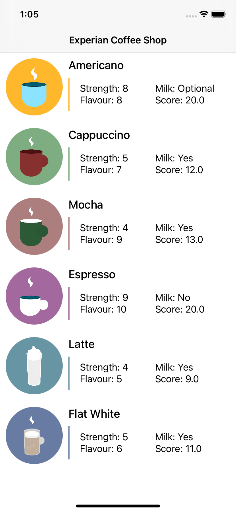
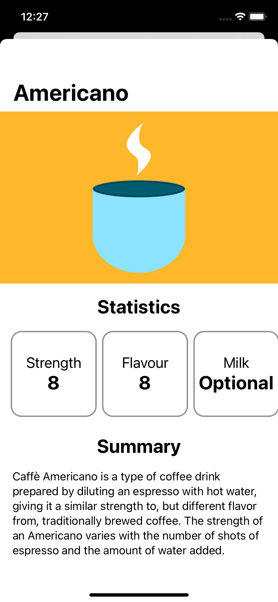
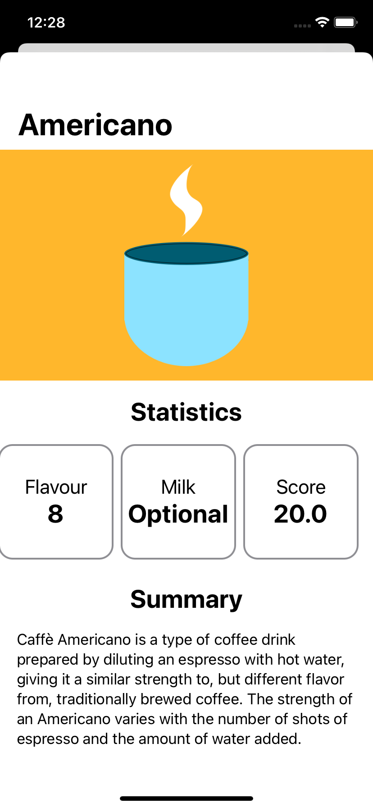

# uk-mobile-tech-test-iOS

## Welcome to the Experian iOS Tech Test

This codebase contains the beginning of a fictional Coffee information app.

This tech test is designed to be an interactive exercise where we can work together to solve a series of tasks where you take the lead and the Experian team support/guide. During this test you are:

1. Allowed to ask for help
2. Google/Stack Overflow as you work
3. Use Git to save your work and show your progress.

### Important: Do not start any of the tasks below before the interview

The project contains many unfinished areas and intentional errors. There are three main tasks that we would like you to attempt **_during_** the tech test on the call. They are as follows:

1. Design work. Update the coffee list and details to represent the designs (see below). The coffee list is written in UIKit, the details page is written in SwiftUI.
2. JSON parsing with the V2 Coffee API and updating any models as required. 
3. Unit testing. Add unit testing to the Coffee model and coffee service.

To help you, the pods for this project have been included in the repo.

## Designs

